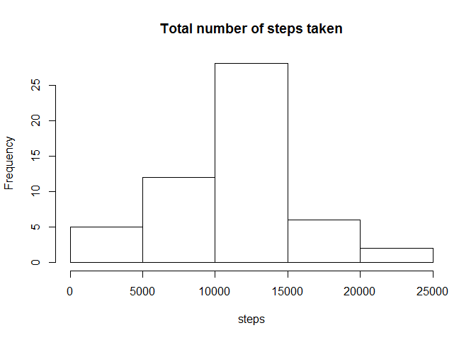
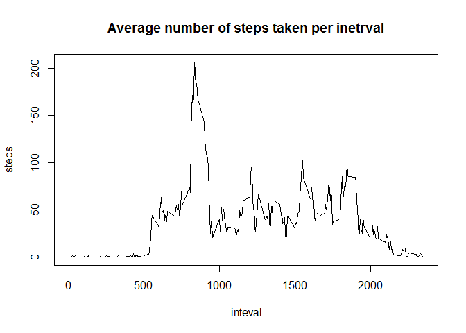
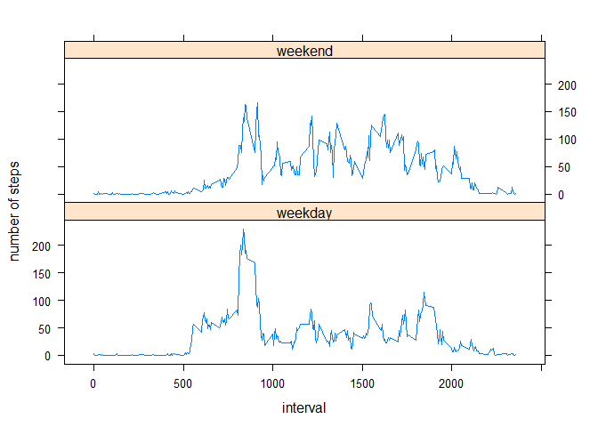

# Reproducible Research: Peer Assessment 1


## Loading and preprocessing the data

```r
library(dplyr)
library(lattice)
activity<-read.csv('activity.csv')
```


## What is mean total number of steps taken per day?

```r
steps.date<-activity %>% filter(!is.na(steps)) %>% group_by(date)  %>% summarize(steps=sum(steps))
hist(steps.date$steps,main="Total number of steps taken",xlab="steps")
```

 

```r
options(scipen=999)
steps.mean<-as.integer(mean(steps.date$steps))
steps.median<-median(steps.date$steps)
```
Mean steps per day : 10766  
Median steps per day : 10765  

## What is the average daily activity pattern?

```r
steps.interval <- activity %>% filter(!is.na(steps)) %>% group_by(interval)  %>% summarize(steps=mean(steps))
plot(steps.interval$interval,steps.interval$steps,type="l", 
          main="Average number of steps taken per inetrval", ylab="steps", 
          xlab="inteval")
```

 

```r
steps.max<-steps.interval$interval[steps.interval$steps==max(steps.interval$steps)]
```
The 5 minutes interval starting at 835 minutes contains the maximum evarage number of steps.


## Imputing missing value

```r
na_count<-nrow(activity[!(complete.cases(activity)),])
```

The sourse data contains 2304 missing values, NA's. I substitute the missing values with the culculated mean of steps per interval.

```r
activity.na_added<-activity[!(complete.cases(activity)),c(2,3)] %>% inner_join(steps.interval,by="interval")
activity.filled<-rbind(activity[(complete.cases(activity)),],activity.na_added)

steps.filled.date<-activity.filled %>% group_by(date)  %>% summarize(steps=sum(steps))
hist(steps.filled.date$steps,main="Total number of steps taken each day, NA's substituted",xlab="steps")
```

 

```r
steps.mean.filled<-round(mean(steps.filled.date$steps))
steps.median.filled<-round(median(steps.filled.date$steps))
```

After subtituted the NA's we got:  
Mean steps per day: 10766  
Median steps per day : 10766  

The differens between the two dataset, with and without substituting the NA's, are very small. Te mean is almost identical and the median value only differ by 1 step.

## Are there differences in activity patterns between weekdays and weekends?


```r
#Change system time setting, to get english names
curr_locale <- Sys.getlocale("LC_TIME")
Sys.setlocale("LC_TIME", "C")

wd<-data.frame(day=c("Monday","Tuesday","Wednesday","Thursday","Friday","Saturday","Sunday"),
               daytype=c("weekday","weekday","weekday","weekday","weekday","weekend","weekend"))
steps.typeofday<-activity.filled %>% mutate(day=weekdays(as.Date(activity.filled$date))) %>% 
               inner_join(wd) %>% 
               group_by(interval,daytype) %>% 
               summarize(steps=mean(steps))
xyplot(steps ~ interval | factor(daytype), data=steps.typeofday, type="l",layout=c(1,2),ylab="number of steps")
```

 

```r
#Set the system time back to original setting
Sys.setlocale("LC_TIME",curr_locale)
```
The weekend values are more even distibuted over the day than the weekday values. The weekday values has as bigger peek at the interval between 800 and 900 minutes.
